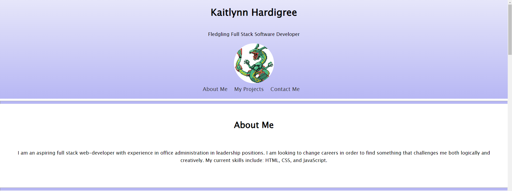

# <Kaitlynn Hardigree-Portfolio>

## Description

This project serves as a personal portfolio in order to showcase the projects I have completed and the skills I have aquired.

## Installation

This project can be accessed clicking the URL, which should open it in any browser. 

## Usage

This website is meant to be used as a personal portfolio. As such, you can click on the images in order to be taken to projects as completed by me.

## Credits

In collaboration with: 
The UNC Chapel Hill/EdX Full Stack Bootcamp

With special credits to: 

Siosia Fonua
Tristin Rohr
Nicholas Zamboni

## License

MIT License 
---

